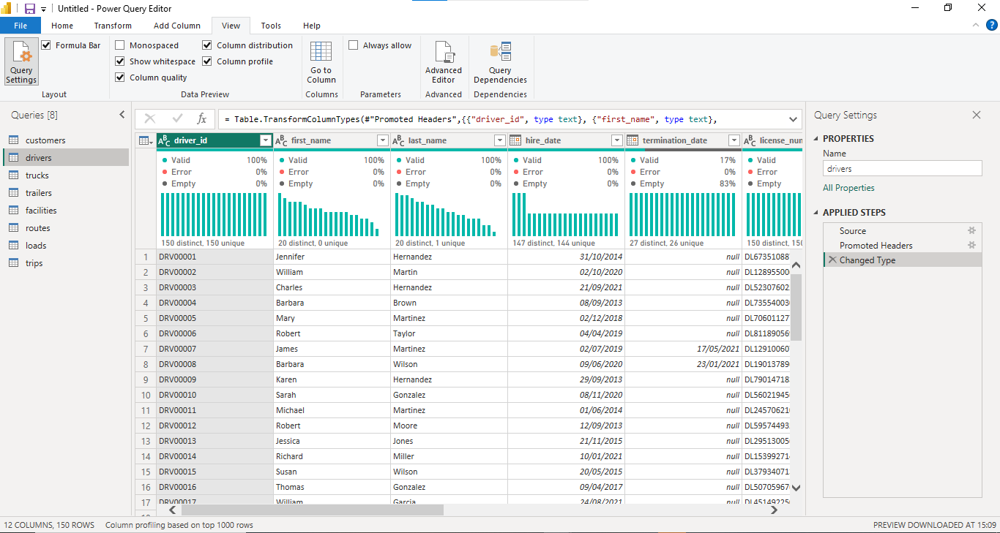
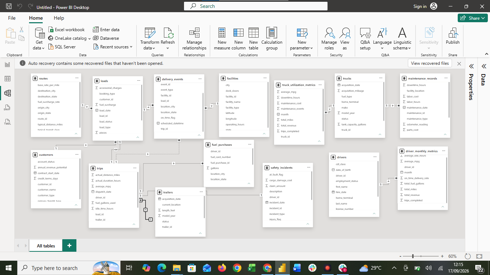
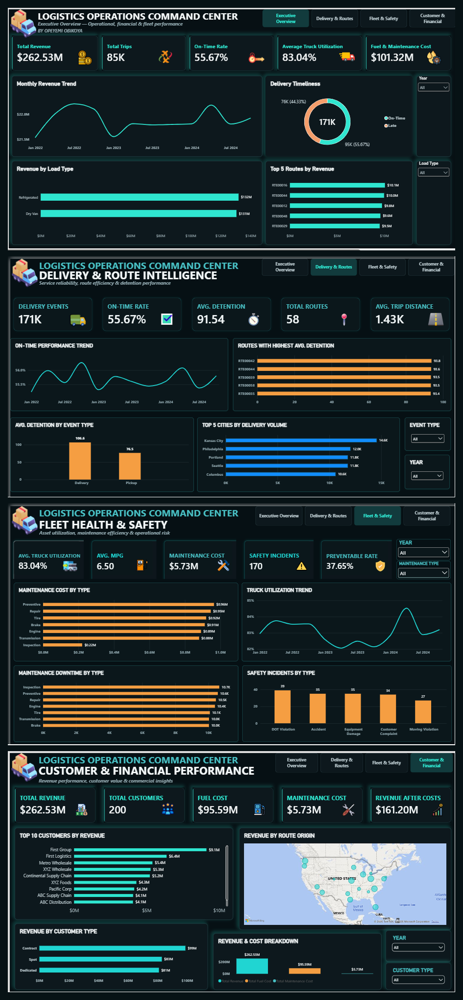

# Logistics Operations Command Center

**A Power BI Data Analytics Capstone Project by Opeyemi Obikoya**  
**Training:** TS Academy | **Tutor:** Ezekiel Aleke

An exploratory analysis of the TS Academy Logistics Operations Database, comprising 14 related Excel sheets covering shipments, customers, routes, drivers, vehicles, fuel, maintenance, delivery events and safety. The project uses four interconnected dashboard pages to examine operational and commercial performance.

## Data Preparation & Transformation

Before building the dashboards, I prepared and validated the logistics datasets in Power Query. This included reviewing column quality and distribution, validating data types, checking missing values, and preparing the tables for analysis.

## Data Model

I built relationships across the logistics datasets to support analysis across customers, routes, loads, trips, delivery events, facilities, drivers, trucks, fuel purchases, maintenance records, safety incidents, and operational metrics.

## Dashboard pages

1. **Executive Overview:** revenue, trips, delivery timeliness, fleet utilization and costs.
2. **Delivery & Route Intelligence:** monthly on-time trend, detention by event type and route, and delivery volume by city.
3. **Fleet Health & Safety:** utilization, fuel efficiency, maintenance downtime and safety incidents.
4. **Customer & Financial Performance:** customer rankings, customer segments, geographic revenue and operating costs.

## Headline results

| Measure | Result |
|---|---:|
| Total revenue | $262.53M |
| Trips | 85,410 |
| On-time event rate | 55.67% |
| Average truck utilization | 83.04% |
| Fuel cost | $95.59M |
| Maintenance cost | $5.73M |
| Safety incidents | 170 |

## Key findings and potential business actions

- **Delivery reliability:** 55.67% of recorded pickup/delivery events were on time. Investigate late events by route, facility and event type before attributing causes.
- **Detention:** deliveries averaged 106.6 minutes of detention versus 76.5 minutes for pickups. Review high-detention routes and facility appointment processes.
- **Fleet and maintenance:** average truck utilization was 83.04%; inspections generated roughly 10.7K hours of downtime. Review inspection scheduling and vehicle availability.
- **Safety:** 64 of 170 recorded incidents were flagged preventable. Examine incident patterns to inform targeted prevention.
- **Commercial performance:** contract customers generated approximately $99M in revenue. Evaluate service performance and full customer-level costs alongside revenue.

## Method and limitations

Data was explored and transformed in Power Query, related in a Power BI data model, and analyzed using DAX measures and interactive visuals. The monthly on-time trend shows **2022–2024**: January 2025 has only approximately two days of scheduled-event data, so it was excluded **from that trend chart only**. Its records remain in the underlying data and unfiltered overall metrics. **$161.20M revenue after fuel and maintenance is not net profit**, because other expenses are not included. Chart values are rounded; operational causes require additional record-level investigation.

## Repository contents

- `screenshots/Opeyemi_Obikoya_Logistics_Capstone_Dashboard.png` — combined four-page dashboard image
- `screenshots/01_...` through `04_...` — individual dashboard pages
- `report/logistics_capstone_analytical_report.pdf` — analytical findings and recommendations
- `powerbi/` — add the original `.pbix` file if sharing is permitted and the file size is supported

**Dataset:** TS Academy Capstone Project, *Logistics Operations Database* (training dataset). Original data files are not included; confirm redistribution permission before publishing them.

**Tools:** Power BI, Power Query, DAX, data modeling and data visualization.
